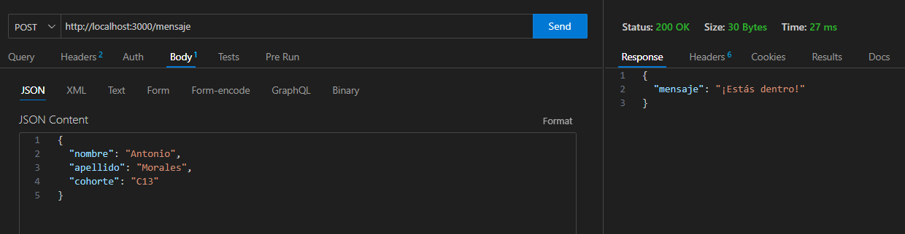

# Ejercicio Técnico
Ejercicio de prueba para poder acceder al programa Techxcelerators

- [Instalación](#instalaci%C3%B3n)
- [Archivo index.mjs](#archivo-indexmjs)
- [Prueba de endpoint](#prueba-de-endpoint)


## Instalación

1. Se realizan las siguientes instalaciones en la terminal

```sh
npm init -y
npm install express
npm i -D nodemon
```

2. Se agrega la instrucción `"type: "module"` en package.json, para poder utilizar las importaciones de la forma:
 - `import <nombre> from <ruta/nombre>`, ya que la mayoría de las herramientas modernas están optimizadas para trabajar con `import` (ej: vite)
 - `const <nombre> = require (<ruta/nombre>)`, solo para proyectos antiguos o si es necesario cargar módulos condicionalmente (dentro de un `if`)

```json
...
  },
  "type": "module"
}
```

3. Se crea la carpeta `src` donde irá el proyecto

```sh
mkdir src
```

3. Se realizan las siguientes modificaciones en package.json:

    - Se modifica `"main": "index.js"` a  `"main": "index.mjs"`
    - Se agrega `"start": "nodemon ./src/index.mjs"` 

```json
...
{
  "name": "prueba_tecnica",
  "version": "1.0.0",
  "main": "index.mjs",
  "scripts": {
    "test": "echo \"Error: no test specified\" && exit 1",
    "start": "nodemon ./src/index.mjs"
  },
  "keywords": [],
  "author": "",
  "license": "ISC",
  "description": "",
  "dependencies": {
    "express": "^4.21.1"
  },
  "devDependencies": {
    "nodemon": "^3.1.7"
  },
  "type": "module"
}
...
```

## Archivo `index.mjs`

```js
import express from "express";

const app = express();
const PORT = 3000;

app.use(express.json());

app.post('/mensaje', (req, res) => {
    const { nombre, apellido, cohorte } = req.body;

    if (!nombre || !apellido || !cohorte) {
        return res.status(400).json({ mensaje: 'Faltan datos. Por favor envía nombre, apellido, y cohorte.' });
    }
    res.status(200).json({ mensaje: '¡Estás dentro!' });
});

app.listen(PORT, () => {
    console.log(`Servidor corriendo en http://localhost:${PORT}`);
});
```


## Prueba de endpoint

Se utiliza la extensión "ThunderClient" para realizar las pruebas de endpoint

